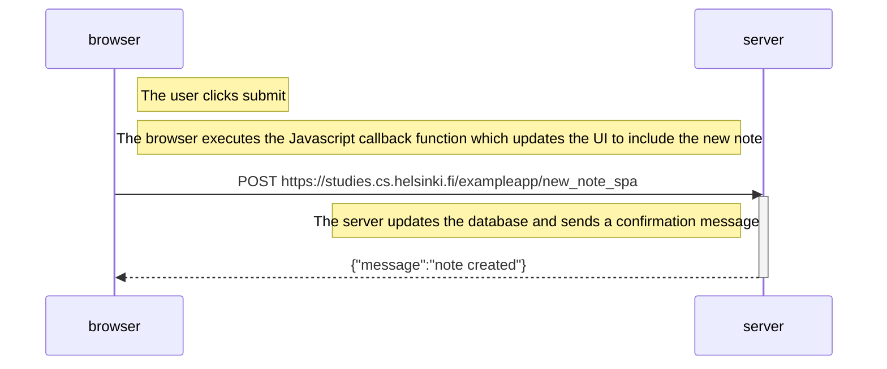

```mermaid
sequenceDiagram
    participant browser
    participant server
    
    Note right of browser: The user clicks submit
    Note right of browser: The browser executes the Javascript callback function which updates the UI to include the new note

    browser->>server: POST https://studies.cs.helsinki.fi/exampleapp/new_note_spa
    activate server
    Note left of server: The server updates the database and sends a confirmation message
    server-->>browser: {"message":"note created"}
    deactivate server
    
    

```